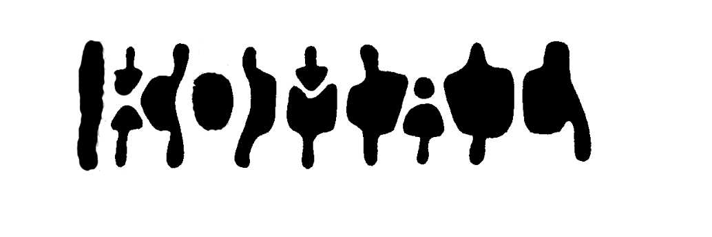

### Hi, 
I'm Komal, a software engineer.

<figure>
  
  <figcaption>
  <medium>
    "inspired from Figure and Ground (Gödel, Escher, Bach: an Eternal Golden Braid)"
  </medium>
  </figcaption>
</figure>

* [About](/about)
* [Contact](/contact)
* [RSS](/posts/index.xml)

